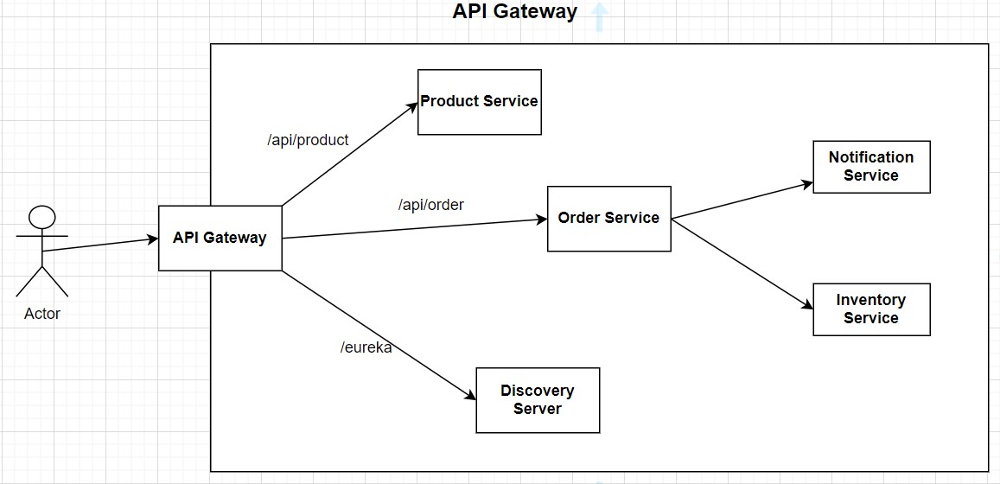

## DISTRIBUTED INFORMATION SYSTEMS

## Online Shopping Application - description of business logic

This application implements a microservice system for online shopping. The microservice system (implemented using `Spring Boot` and `Spring Cloud`) consists of the following services:

- Product Service - This microservice has the role of a catalog and it is possible to create new products and view all products from the catalog.
- Order Service - This microservice is for ordering products.
- Inventory Service - After ordering the product, this microservice checks whether the product is in stock or not.
- Notification Service - This microservice is used to send notifications, after order is placed.
- Discovery Service - Enables dynamic discovery and communication between services.
- API Gateway - Entry point for all client-side requests, enabling access control, request routing, and data authentication from various microservices.

## Microservice system diagram

The microservice architecture is shown in the figure below.


As for the databases that microservices communicate with, the Product service is talking to a `MongoDB`, the Order service is talking to the `MySQL` and the Inventory service is talking also to the `MySQL` database, to store all the inventory information. Notification service is a `stateless service` which doesn't have any database because it is responsible to send out notifications to users.

Also, synchronous and asynchronous communication between services has been established. [Kafka](https://spring.io/projects/spring-kafka) was used for asynchronous communication. Services are secured using the authorization server called as [Keycloak](https://www.keycloak.org/getting-started/getting-started-docker).

### Discovery Service

The Discovery Server ([Eureka Server](https://spring.io/projects/spring-cloud-netflix)), is a crucial component in a microservices architecture. Its primary purpose is to enable service discovery and registration, making it an essential tool for managing the dynamic and distributed nature of microservices. In a project, the Discovery Server serves as a central directory where microservices can register themselves upon startup. Each microservice instance sends its metadata (such as service name, host, and port) to the Discovery Server. This information is then made available to other microservices, allowing them to locate and communicate with each other.


### API Gateway

[API Gateway](https://spring.io/projects/spring-cloud-gateway) acts as a reverse proxy, aggregating and managing requests, routing them to the appropriate microservices, and providing essential functionalities such as authentication, authorization, load balancing, and request transformation. Instead of clients needing to communicate directly with multiple services, they can interact solely with the API Gateway, which abstracts the complexities of the underlying microservices architecture.



### Circuit Breaker

[Circuit Breaker](https://spring.io/projects/spring-cloud-circuitbreaker) is a software pattern used in distributed systems to enhance their resilience and fault tolerance. It helps prevent cascading failures in a system by temporarily "opening" the circuit to a service that is experiencing issues. When the circuit is open, requests to the problematic service are automatically stopped or redirected, allowing the service to recover. For implementing a Circuit Breaker pattern in a microservice application, we are using the `Resilience4j` library.

### Distributed Tracing

Microservices are set up to send trace data to the `Zipkin` server asynchronously via message brokers. [Spring Cloud Sleuth](https://spring.io/projects/spring-cloud-sleuth) is used to gather and maintain this trace information within memory.

### Prometheus and Grafana

Prometheus and Grafana are commonly used for `monitoring` and observability in distributed systems and microservices architectures. Prometheus is used for collecting and storing time-series data, while Grafana is used for visualizing and analyzing this data. 

### Docker

Docker Compose serves as a tool for defining and orchestrating multi-container Docker applications. It leverages a user-friendly YAML file, `docker-compose.yml`, to specify the configuration of services, which can be effortlessly created and initiated by the Docker Daemon.

## Pipeline Management Guide

- Run the application using Docker

```bash
  mvn clean package -DskipTests
  docker-compose up -d
```
- Run the application without Docker

```bash
  mvn clean verify -DskipTests
  mvn spring-boot:run
```
