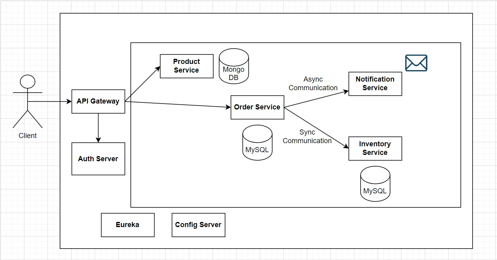
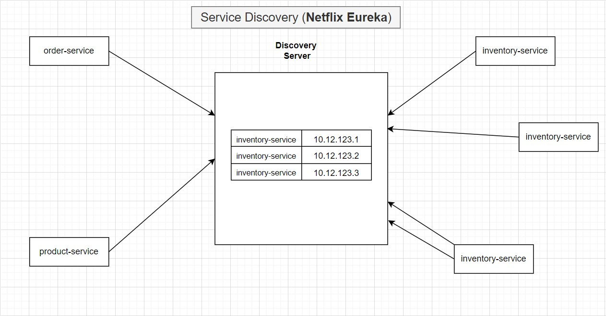

# DISTRIBUTED INFORMATION SYSTEMS

# Online Shopping Application - Microservices

This application implements a microservice system for online shopping. The microservice system consists of the following services:

- Product Service - This microservice has the role of a catalog and it is possible to create new products and view all products from the catalog.
- Order Service - This microservice is for ordering products.
- Inventory Service - After ordering the product, this microservice checks whether the product is in stock or not.
- Notification Service - This microservice is used to send notifications, after order is placed.
- Discovery Service - Enables dynamic discovery and communication between services.
- API Gateway - Entry point for all client-side requests, enabling access control, request routing, and data authentication from various microservices.

## Microservice system diagram

### Discovery Service

